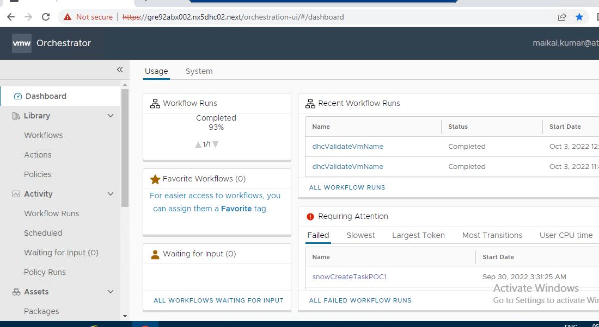

# VRA SERVICENOW  Itegration User Guide for creating RITM.

# Changelog
  
| Version | Date       | Description              | Author       |
| ------- | ---------- | ------------------------ | --------------- |
| 0.1     | 10/06/2022 | First version | Maikal Kumar |

# Table of Contents

[BluePrint User Guide for Linux Machine
1](#blueprint-user-guide-for-linux-machine)

[Introduction 3](#Introduction)

[Purpose 3](#purpose)

[Audience 3](#audience)

[Scope 3](#scope)

[How to deploy a VM using blueprint 3](#_Toc90593289)

[1. VM Deployment in DHC Cloud 4](#vm-deployment-in-dhc-cloud)

# Introduction

Blueprinting service Catalog item in a vRA service broker lets end user
easily deploy virtual server in required cloud endpoint (DHC, Azure,
Etc).

# Purpose

How integrate Servicenow from VRA to Create RITM in service now using vRA.

# Audience

This document is intended for Developer or End users who are responsible
to edit/configure anthing in service now using VRA Event.

# Scope

The scope of this document covers the following:

  - Select a specific vRA event Topic such as ***Restart VM***, ***Delete Deployment***, ***Provision the VM*** etc.

  - Create a VRO workflow to log the request in service now.

  - create an RITM and close the RITM once Event is done. 

# Process  
1. **Get the required access of VRA and Service now to create a RITM.**
	> Verify the access of both the Tools.
3. **List out the API to Create the request.** 
 	> To Create a RITM In Service Now, we have used below api.
 	> 
 	> ***URL:-*** https://atosglobaldev.service-now.com/api/x_aits2_appintinbo/order/create
 	
	> ***Request Method:-*** POST

	> Header: - 
		
        content Type: Application/json
        Authoraization: Basic
        
    > ***Request Body:-*** 
  
  		{  
        "transactionID":"S0760.001.01",
        "externalid":custDeploymentId,
        "organisation":"DHC Test1",
        "short_description":"VM Reboot",
        "CRM": "DHC-AUT-D",
        "orderDetail":{
        "vm_owner":"DHC Test001",
        "vm_site":"dhc.test001@dhctest001.com",
        "virtual_machine" :"dhctestnpapp01",
        "power_action":"Restart",
        "business_justification":"Test_BR01",
        "description":"VM Has rebooted for Some reason"
          }
        }
        
   # Description of JSON Attribute
   
   | Attempt | Type    | Required |Description   |
   | :---:   | :---: | :---: | :---: |
   | Transaction Id | String   | Yes   | This is catalog mapping id, it varries based on catalog. for eg: S0760.001.01 is the mapping to restart virtul Machine.
   | ExternalId | String   | Yes   | This can be be anything in string.
   | Organisation | String   | Yes   | This is fixed "DHC Test1".
   | Short Description | String   | Yes | Short description for request.
   | CRM | String   |  Yes | This is fixed String "DHC-AUT-D".
   | VM Owner | String   | Yes   | This is a fixed String "DHC Test001".
   | VM Site | String   | Yes   | This is fix String "dhc.test001@dhctest001.com".
   | Virtual_Machine | String   | Yes   | This is Fixed Virtual Machine ""dhctestnpapp01".
   | Power_Action | String   | Yes   | This is action that will be performed on VM for eg: "Reboot", "Power Off".
   | Business_Justification | String   | Yes   | The can be anything meaningful.
   | Description | String   | Yes   | This can be used to define the detailed reason of performing action.
   
3. ***Create a WorkFlow in VRO.***
	> To create a workflow, We need to follow bewlow Steps.
	
		1. Login to Respected Environment VRO.
 
	  
		3. Add a resthost by Navigating Library -> Workflow -> Library -> Http-Rest -> Configurtion -> Add a Resthost.
		4. Click on add Resthost.
		5. Click on Run 
		6. Configure the Resthost properties such Host-Properties, Host- Authentication and proxy.
		NOTE:  while adding Host URL,add only baseUrl. for eg: https://atosglobaldev.service-now.com/ is the base url.
        
 4. ***Create a worokflow***
 
 	* This workflow will be called after an event will be trigger from VRA.    
    * To create workflow Navigate to Workflow, under workflow select a folder or create a new folder for eg DHC then create a workflow under that folder using create New workflow.
    * Give the meaningful name of workflow then click on create button.
    * Define varible which will be used in workflow for eg Rest-Host.
    * To define new variable select variable tab and click on new button. After clicking on new button,new dialogue button will open.
    * give the varible name for eg "snowHost".
    * select the type of variable for eg: "RestHost".
    * select the rest host that we have added using add restHost Properties.
    * click on create button.
    * Navigate to Schema Section.drag a scrible task object from left menu in the middle of start and end workflow object.
    * Under gemeral table go to input/output section and select defined variable as a input. to select this click on plus '+' button. and then click on select variable button then select that variable.
    * Go to under script sectio then write required code under this tab. 
    * Once code is written then select click on "RUN".
   
5. ***Configure this workflow in VRA***
	* To Configure workflow in VRA, we need to create a Subscription and then attach in vro workflow in it.
	* Navigate to Extensiblity -> Subscription -> New Subscription.
	* Give the subscription name, select the event topic, select the workflow that we have created in VRO. 
	* if we need to filter any event the we can add condtion as well. to add condition we can use metadata. for eg event.data.oepration == "Reboot" will make this workflow execute only when we will reboot any VMs.
    * NOTE: If we make this subscription is blocking, While executing this workflow other workflow will not be executed until it finishes.
    
6. ***Testing the Workflow***
	* To test the workflow we need to restart the any vm then we will see that event gets trigged and workflow executed succcessfully.
	* To see the worflow runs, navigate to Activity -> workflow Runs. then click on the workflow run id to see the execution details. 
	* Also, we can verify in SNOW portal using RITM that we have got in the log of workflow. 
